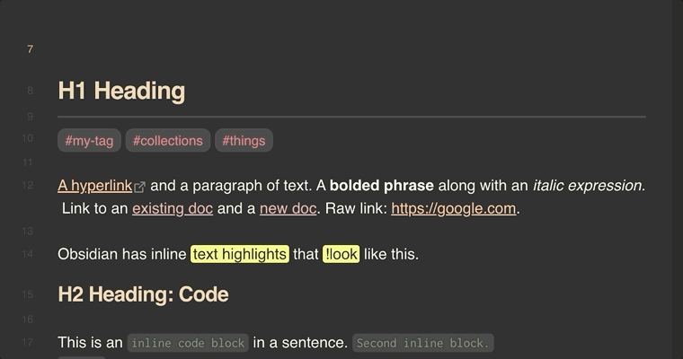
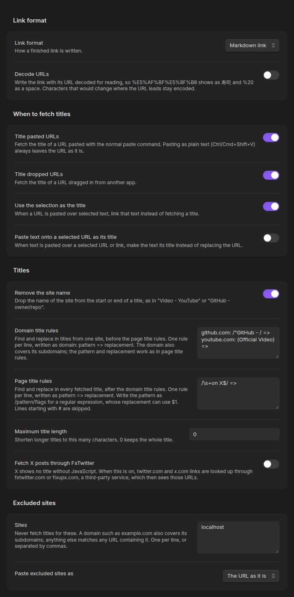

# Named Links

Paste a URL into Obsidian and get a markdown link titled with the page's name: `https://example.com` becomes `[Example Domain](https://example.com)`.



> [!NOTE]
> Named Links is a maintained fork of [Auto Link Title](https://github.com/zolrath/obsidian-auto-link-title) by [@zolrath](https://github.com/zolrath), who deserves the credit for the original plugin. That project has been inactive since [December 2024](https://github.com/zolrath/obsidian-auto-link-title/releases/tag/1.5.5). This fork picks up from 1.5.5, fixes the bugs reported against it, and borrows the Japanese translation, FxTwitter lookups and `<URL>` pasting from [@yuu1111's fork](https://github.com/yuu1111/obsidian-auto-link-title).

## What it does

- **Paste a URL** and a `[Fetching title…](url)` placeholder goes in at once, then becomes the titled link. Paste several URLs and each is titled.
- **Drop a URL** from another app and the same happens where you drop it.
- **Copy a link with its text** (Edge's Copy link, Firefox, or a link dragged out of a page) and that text is the title, with nothing fetched, so it works for pages behind a login.
- **Paste a URL over selected text** to link that text instead of fetching a title.
- **Paste text over a selected URL** to make the text its title (off until you turn it on).
- **Title URLs already in a note** with the **Add a title to an existing URL** command, at the cursor or across a selection.
- **In vim mode**, putting a URL with `p` or `P` titles it too.
- **Undo** gives back the URL as you pasted it; undo again to remove the paste.

A paste is only titled when it's nothing but URLs. It's left as pasted when you paste as plain text (Ctrl/Cmd+Shift+V), paste with several cursors, paste into code, frontmatter or a link target (`[text](`, `[1]: `, `href="`), or paste an image or an excluded site's URL. If no title can be found, the URL stays and a notice says so.

Files such as PDFs are named after their path instead of downloaded, except arXiv papers, which get the paper's title from its abstract page.

## Examples

### Link formats

Set **Link format** to Custom and write a template. These are real results:

| Template | Pasting | Gives |
| --- | --- | --- |
| `[{title}]({url}) (accessed {date})` | `https://obsidian.md/` | `[Obsidian - Sharpen your thinking](https://obsidian.md/) (accessed 2026-10-04)` |
| `[{title} ({author})]({url})` | a YouTube video | `[The essence of calculus (3Blue1Brown)](https://www.youtube.com/watch?v=WUvTyaaNkzM)` |
| `[{title} › {section}]({url})` | `https://en.wikipedia.org/wiki/Markdown#History` | `[Markdown › History](https://en.wikipedia.org/wiki/Markdown#History)` |
| `[{title}]({url}) - {description}` | `https://obsidian.md/` | `[Obsidian - Sharpen your thinking](https://obsidian.md/) - The free and flexible app for your private thoughts.` |

A value the page doesn't have is dropped along with the separator or parentheses next to it, so the same Wikipedia template on a URL without `#History` gives `[Markdown](…)`. The Wikipedia example also has **Remove the site name** on.

### Title clean-up

**Remove the site name** and find-and-replace rules trim titles before they're written:

| Setting | Title | Becomes |
| --- | --- | --- |
| Remove the site name | `GitHub - obsidianmd/obsidian-releases: Community plugins list, … · GitHub` | `obsidianmd/obsidian-releases: Community plugins list, …` |
| Domain title rule `github.com: /^GitHub - ([^:]+):.*$/ => $1` | the same | `obsidianmd/obsidian-releases` |
| Page title rule `(Official Video) =>` | `Rick Astley - Never Gonna Give You Up (Official Video) (4K Remaster)` | `Rick Astley - Never Gonna Give You Up (4K Remaster)` |

### Scripts

In a [Templater](https://github.com/SilentVoid13/Templater) template, this turns the selected URL into a titled link, using your settings:

```
<% await app.plugins.plugins['named-links'].api.getLink(tp.file.selection()) %>
```

## Commands and settings



Every command, setting, placeholder and rule, and the scripting API, is described in [Commands and settings](https://github.com/danyim/obsidian-named-links/blob/main/docs/REFERENCE.md). No command has a default hotkey; set one under Settings → Hotkeys.

## Privacy

Named Links requests the pasted URL from your device, without loading its scripts, images or media, and checks the headers first so large files aren't downloaded. YouTube, Vimeo, Spotify and SoundCloud links go to that site's oEmbed API instead. Excluded sites are never requested, and neither is a link that came with its own title.

The one opt-in exception: **Fetch X posts through FxTwitter** sends twitter.com and x.com URLs to fxtwitter.com or fixupx.com, a third-party service. There's no telemetry.

## Mobile

Works on Obsidian mobile with the long-press **Paste** action. Some keyboards' clipboard shortcuts (Gboard's, for one) don't fire a paste event; use the **Paste URL and fetch its title** command instead.

## Moving over from Auto Link Title

Named Links has its own plugin id, so settings don't carry over by themselves. If Auto Link Title's are still in your vault, the settings tab offers to import them. Disable Auto Link Title once you've switched; while both are on, whichever runs first takes each paste.

What's different from Auto Link Title 1.5.5:

- Titles are read from the page's HTML. Auto Link Title loaded pages in a hidden browser window with Node.js access, running every site's scripts on your machine ([#177](https://github.com/zolrath/obsidian-auto-link-title/issues/177), [#164](https://github.com/zolrath/obsidian-auto-link-title/issues/164)).
- No LinkPreview.net, and no default hotkeys ([#170](https://github.com/zolrath/obsidian-auto-link-title/issues/170), [#101](https://github.com/zolrath/obsidian-auto-link-title/issues/101)).
- Legacy encodings such as GBK decode correctly ([#133](https://github.com/zolrath/obsidian-auto-link-title/issues/133)), and YouTube, Vimeo, Spotify and SoundCloud titles come from oEmbed.
- arXiv PDF links get the paper's title instead of a file name like `2206.08077.pdf` ([#111](https://github.com/zolrath/obsidian-auto-link-title/issues/111)).
- `.ai` domains, hyphenated hosts, ports and IPs are recognized ([#172](https://github.com/zolrath/obsidian-auto-link-title/issues/172), [#154](https://github.com/zolrath/obsidian-auto-link-title/issues/154)), and `www.` URLs get `https://` ([#12](https://github.com/zolrath/obsidian-auto-link-title/issues/12)).
- Stuck requests time out instead of leaving `Fetching Title#…` behind ([#167](https://github.com/zolrath/obsidian-auto-link-title/issues/167)).
- URLs in code and frontmatter are left alone ([#36](https://github.com/zolrath/obsidian-auto-link-title/issues/36), [#21](https://github.com/zolrath/obsidian-auto-link-title/issues/21)), and excluded sites match by domain and can paste as plain URLs ([#159](https://github.com/zolrath/obsidian-auto-link-title/issues/159)).
- Vim's `p` and `P` title URLs ([#7](https://github.com/zolrath/obsidian-auto-link-title/issues/7)), copied links keep their own title ([#129](https://github.com/zolrath/obsidian-auto-link-title/issues/129)), link formats can show the author, description and date ([#15](https://github.com/zolrath/obsidian-auto-link-title/issues/15), [#86](https://github.com/zolrath/obsidian-auto-link-title/issues/86), [#136](https://github.com/zolrath/obsidian-auto-link-title/issues/136)), and scripts can fetch titles ([#52](https://github.com/zolrath/obsidian-auto-link-title/issues/52), [#146](https://github.com/zolrath/obsidian-auto-link-title/issues/146)).

## How it compares

Going by what each plugin's README documents (October 2026); a dash means it isn't mentioned.

| | Named Links | [Auto Link Title](https://github.com/zolrath/obsidian-auto-link-title) | [URL Namer](https://github.com/zfei/obsidian-url-namer) | [Paste URL into selection](https://github.com/denolehov/obsidian-url-into-selection) | [Links](https://github.com/mii-key/obsidian-links) |
| --- | --- | --- | --- | --- | --- |
| Titles a URL as you paste it | Yes | Yes | Optional | No | No |
| Titles URLs already in a note | Command, at the cursor or across a selection | Command, at the cursor | Command, across a selection | No | When converting a URL to a markdown link |
| Several URLs pasted at once | Each titled | - | - | - | - |
| URL pasted over selected text links that text | Yes, by default | Optional | - | Yes | Command |
| Text pasted over a selected URL becomes its title | Optional | - | - | Command | Command |
| Title clean-up and find/replace rules | Yes | Maximum length only | - | - | - |
| Link format (HTML, custom templates) | Yes | - | - | - | Converts between link types |
| How it reads titles | From the page's HTML, without running the page | A hidden browser window that runs the page, by default | From the page's HTML | Doesn't | From the page's HTML |
| Last updated | October 2026 | December 2024 | April 2026 | August 2025 | March 2026 |

If you only need to turn selected text into a link, Paste URL into selection is lighter, and Links does far more for converting and editing links. Named Links is about getting a good title on a URL with as little effort as possible.

## Development

See [docs/DEVELOPMENT.md](docs/DEVELOPMENT.md) and [docs/TESTING.md](docs/TESTING.md). Contributions are welcome; see [CONTRIBUTING.md](CONTRIBUTING.md).

## License

[MIT](LICENSE). If this plugin is useful to you, consider [buying me a coffee](https://buymeacoffee.com/danyim).
