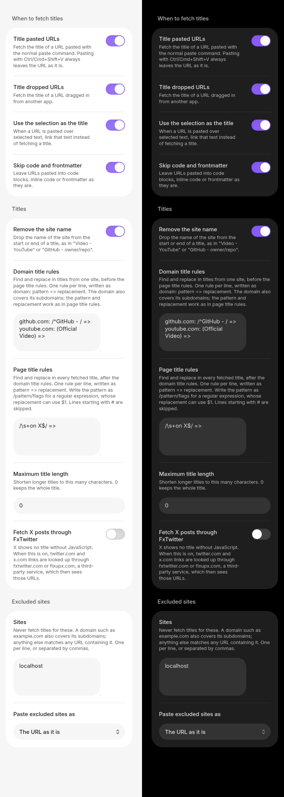

# Named Links

Paste a URL into Obsidian and get a markdown link titled with the page's name:

```
https://example.com
```

becomes

```
[Example Domain](https://example.com)
```


> [!NOTE]
> **Named Links is a maintained fork of [Auto Link Title](https://github.com/zolrath/obsidian-auto-link-title) by [@zolrath](https://github.com/zolrath)**, who deserves the credit for the original plugin and its design. That project has seen no activity since [December 2024](https://github.com/zolrath/obsidian-auto-link-title/releases/tag/1.5.5), with dozens of open issues and pull requests.
>
> Named Links picks up from Auto Link Title 1.5.5, fixes the bugs reported against it, and keeps it working with current versions of Obsidian. It also borrows several improvements from [@yuu1111's fork](https://github.com/yuu1111/obsidian-auto-link-title): the Japanese translation, fetching X posts through FxTwitter, and pasting `<URL>` autolinks.

## What it does

- **Pasting a URL** inserts a `[Fetching title…](url)` placeholder straight away, then swaps in the page title once it arrives. Several URLs pasted at once, one per line or separated by spaces, are each titled.
- **Dropping a URL** dragged in from a browser or another app does the same, at the spot where you drop it.
- **Add a title to an existing URL** (a command, so give it a hotkey under Settings → Hotkeys) titles the URL under the cursor. On an existing `[text](url)` link it replaces the text with the fetched title, and a `<URL>` autolink becomes a titled link. With text selected, it titles every bare URL the selection touches, skipping code, frontmatter, and URLs that are already part of a link, image or reference definition.
- **Paste URL and fetch its title** and **Paste without fetching a title** are commands too, for binding to hotkeys of your own.
- **Undo** after a title arrives gives back the URL as you pasted it, and undoing again removes the paste. On a link added with **Add a title to an existing URL**, one undo returns it to what it was. If you edit the note while a title is still on its way, the first undo still gives back the URL, but the next one shows the placeholder rather than removing the paste.

The URL is left exactly as pasted when:

- you paste with **Ctrl/Cmd+Shift+V**, Obsidian's paste-as-plain-text shortcut;
- it goes into a link target (`[text](`), a reference definition (`[1]: `), an HTML attribute (`href="`), or after a `<`;
- you paste with several cursors;
- it goes into a code block, inline code or frontmatter (this can be turned off);
- it is an image, so it can still be embedded;
- the site is on your excluded list;
- no title could be found. A notice says so, and nothing is left behind in the note.

Titles are cleaned up before they go in: line breaks become spaces, and characters that would change how the link renders (`[`, `]`, `|`, `*`, `_`, `` ` ``, `$`, `==`, a `#` that would start a tag, and so on) are escaped. A file such as a PDF is named after its path rather than downloaded.

## Settings


On a phone the same settings stack into one column:



| Setting | Default | |
| --- | --- | --- |
| Title pasted URLs | On | Fetch the title when a URL is pasted with the normal paste command. |
| Title dropped URLs | On | Fetch the title when a URL is dropped into the editor. |
| Use the selection as the title | On | Pasting a URL over selected text links that text instead of fetching. Turn it off to replace the selection with the fetched title. |
| Skip code and frontmatter | On | Leave URLs pasted into code or frontmatter alone. |
| Remove the site name | Off | Drop the site's name from the start or end of a title: `Video - YouTube` becomes `Video`. See [Cleaning up titles](#cleaning-up-titles). |
| Domain title rules | Empty | Your own find/replace rules for titles from particular sites, run first. See [Cleaning up titles](#cleaning-up-titles). |
| Page title rules | Empty | Your own find/replace rules for every title, run after the domain rules. See [Cleaning up titles](#cleaning-up-titles). |
| Maximum title length | 0 (no limit) | Shorten longer titles, ending them with `…`. |
| Fetch X posts through FxTwitter | Off | See [Privacy](#privacy). |
| Excluded sites | Empty | Sites never fetched. `example.com` covers the domain and its subdomains; an entry with a path, or any other text, matches URLs containing it. |
| Paste excluded sites as | The URL as it is | Or as a link titled with the domain, as Auto Link Title did. |

### Cleaning up titles

A fetched title goes through these steps in order: its whitespace is tidied, the site's name is removed (if turned on), your domain title rules for that site run, then your page title rules, and then it is shortened to the maximum length and escaped. Each step is optional: use either set of rules, both, or neither.

**Remove the site name** looks at the part of the title after the last separator, and before the first one, and drops either if it names the site. A separator is a `|`, `-`, en or em dash, `·`, `•`, `::` or `»` with a space on each side, so a hyphenated word is never split. The site's name is the one the page declares (its `og:site_name`), or else the name in its address, such as `nytimes` for `www.nytimes.com`. A part counts as the site's name when it spells that name, ignoring case, spaces, punctuation and a leading "The", either in full or abbreviated: "The New York Times" matches `nytimes` and "Wall Street Journal" matches `wsj`. At the end of a title, a part that starts with the name also counts, so "BBC News" matches `bbc.com`; at the start it has to be the name itself, so "GitHub Copilot · Your AI pair programmer · GitHub" keeps "GitHub Copilot". A title is never reduced to nothing.

| Before | After |
| --- | --- |
| `owner/repo: A description · GitHub` | `owner/repo: A description` |
| `GitHub - owner/repo: A description` | `owner/repo: A description` |
| `An article \| The New York Times` | `An article` |
| `C - The Language` on another site | unchanged |

**Page title rules** are find and replace on every title, one rule per line, written `pattern => replacement`:

```
# Lines starting with # are skipped.
(Official Video) =>
/^\[(\w+)\] (.*)$/ => $2 ($1)
/\s+on X$/ =>
```

**Domain title rules** are the same, but each line starts with the site it applies to, written `domain: pattern => replacement`, and they run before the page title rules. A domain also covers its subdomains, matched the way excluded sites are, so `x.com` doesn't catch `netflix.com`:

```
github.com: /^GitHub - / =>
youtube.com: (Official Video) =>
*.substack.com: / \| .*$/ =>
en.wikipedia.org: / - Wikipedia$/ =>
```

Both kinds of rule work the same way:

- A pattern is literal text, replaced wherever it appears, unless it is written `/pattern/flags`, which makes it a regular expression. A regular expression replaces only its first match unless it has the `g` flag, and its replacement can refer to groups as `$1`, `$2` and so on.
- Spaces around `=>` are ignored, and an empty replacement deletes what the pattern matched. Leftover spaces are tidied afterwards.
- Rules run in order, each on the result of the one before.
- A line that isn't a valid rule is skipped, and the settings tab says which line and why.
- If the rules would leave the title empty, it is kept as it was before them.

## Moving over from Auto Link Title

Named Links has its own plugin id, so Obsidian treats it as a separate plugin and your Auto Link Title settings don't carry over by themselves. If they are still in your vault, the settings tab offers an **Import from Auto Link Title** button that copies them over. While both plugins are enabled, the tab also says so: whichever one runs first takes each paste, so disable Auto Link Title once you've moved over.

What changed from Auto Link Title 1.5.5:

- Titles are read from the page's HTML with Obsidian's `requestUrl`. Auto Link Title loaded each page in a hidden Electron window with Node.js access and web security turned off, which ran every pasted site's scripts with access to your computer, played its media, and could leave the window running ([#164](https://github.com/zolrath/obsidian-auto-link-title/issues/164), [#177](https://github.com/zolrath/obsidian-auto-link-title/issues/177)). Named Links never runs a page's scripts.
- The LinkPreview.net option is gone, so no URL is sent to a third party unless you turn on the FxTwitter option.
- No default hotkeys. Auto Link Title claimed Ctrl/Cmd+Shift+V and Ctrl/Cmd+Shift+E, which broke plain-text paste on some keyboard layouts ([#170](https://github.com/zolrath/obsidian-auto-link-title/issues/170), [#101](https://github.com/zolrath/obsidian-auto-link-title/issues/101)). Plain-text paste now works through Obsidian's own shortcut.
- Pages in GBK and other legacy encodings no longer come out garbled ([#133](https://github.com/zolrath/obsidian-auto-link-title/issues/133)); YouTube, Vimeo, Spotify and SoundCloud titles come from their oEmbed APIs; pages without a `<title>` fall back to Open Graph metadata.
- Domains ending in `.ai` are no longer mistaken for Illustrator files ([#172](https://github.com/zolrath/obsidian-auto-link-title/issues/172)), and hyphenated or single-letter domains, ports and IP addresses are recognized ([#154](https://github.com/zolrath/obsidian-auto-link-title/issues/154)).
- A request that never answers gives up after 15 seconds instead of leaving `Fetching Title#…` in the note ([#167](https://github.com/zolrath/obsidian-auto-link-title/issues/167)), and a title that comes back after you've switched notes is written into the right one.
- The title lands in the right place on any line, a URL at the start of a line can be titled, pasting next to an existing URL no longer replaces it, and a dropped URL lands where it is dropped.
- `www.example.com` becomes an `https://` link rather than a broken relative one ([#12](https://github.com/zolrath/obsidian-auto-link-title/issues/12)).
- URLs pasted into code, inline code or frontmatter are left alone ([#21](https://github.com/zolrath/obsidian-auto-link-title/issues/21), [#58](https://github.com/zolrath/obsidian-auto-link-title/issues/58), [#153](https://github.com/zolrath/obsidian-auto-link-title/issues/153), [#166](https://github.com/zolrath/obsidian-auto-link-title/issues/166)), as are pasted `<URL>` autolinks' contents ([#156](https://github.com/zolrath/obsidian-auto-link-title/issues/156)).
- Excluded sites match by domain, so `x.com` no longer excludes `netflix.com`, and can be pasted as plain URLs ([#159](https://github.com/zolrath/obsidian-auto-link-title/issues/159)).

## Privacy

To find a title, Named Links requests the pasted URL from your device, the same as opening it in a browser would, except that none of the page's scripts, images or media are loaded. It first asks for the page's headers only, so a large file is never downloaded. For YouTube, Vimeo, Spotify and SoundCloud links it asks that site's oEmbed API instead.

Nothing else leaves your device, with one opt-in exception: with **Fetch X posts through FxTwitter** turned on, twitter.com and x.com URLs are requested from fxtwitter.com or fixupx.com, a third-party service, which then sees those URLs.

There is no telemetry and no other network use. Sites you list under **Excluded sites** are never requested at all.

## Mobile

Named Links works on Obsidian mobile. Paste with the long-press **Paste** action. Some keyboards' clipboard shortcuts (Gboard's clipboard strip, for one) insert text without a paste event, so the plugin never sees them; use the **Paste URL and fetch its title** command instead.

## Development

See [docs/DEVELOPMENT.md](docs/DEVELOPMENT.md) for building the plugin and [docs/TESTING.md](docs/TESTING.md) for running the test suite. Contributions are welcome; [CONTRIBUTING.md](CONTRIBUTING.md) has the details.

## License

[MIT](LICENSE)

If this plugin is useful to you, please consider [buying me a coffee](https://buymeacoffee.com/danyim).
